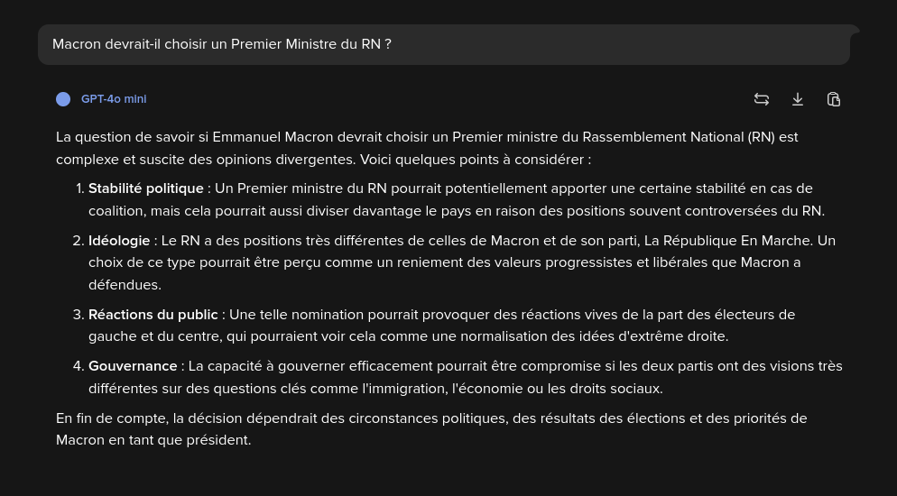

# ChatGPT et les limites de la réflexion

> Si les données humaines sont les énergies fossiles de l'IA,
> l'apprentissage par renforcement sur les problèmes vérifiables,
> c'est donc, en quelque sorte, leur énergie renouvelable.
> Alors, si cette intuition est correcte,
> il est vraisemblable qu'à l'avenir, 
> la course ne soit plus vers le gigantisme des modèles pré-entraînés,
> mais vers l'intelligence des modèles fine-tunés.
> [Les 4 étapes pour entraîner un LLM, Science Étonnante, 27:10](https://tournesol.app/entities/yt:YcIbZGTRMjI)

Il y a quelques jours, David Louapre de la chaîne Science Étonnante
a publié une vidéo sur l'entraînement des algorithmes génératifs.
Comme toujours, David a fourni des explications d'une qualité pédagogique remarquable,
et j'ai même appris plusieurs choses que je ne savais pas grâce à sa vidéo,
comme des précisions sur quels chatbots ont suivi quelles procédures d'entraînement.

Cependant, la conclusion de sa vidéo m'a paru confuse,
et pas seulement parce que la réflexion des algorithmes génératifs
est très loin de n'utiliser que des énergies renouvelables.
Pour être plus précis, la citation donne l'impression
que les données humaines peuvent être parfaitement substituées par de la réflexion,
tout comme l'énergie fossile peut être substituée par des énergies renouvelables.

Or ça, ça me paraît trompeur, ne serait-ce que pour des questions d'unités physiques.
L'énergie fossile et l'énergie renouvelable peuvent toutes deux se mesurer en joules,
et il est donc raisonnable de s'attendre à pouvoir remplacer l'une par l'autre.
Mais les données humaines se mesurent en bits, 
ou en giga-octets qui correspondent à 8 x 10⁹ bits.
Tandis que la réflexion se mesure en nombre d'opérations par secondes, typiquement en FLOAPs.
Or les FLOAPs et les giga-octets, ça paraît extrêmement différent.

Mais surtout, de manière plus fondamentale,
la complexité des données, cela renvoie à la notion de complexité de Solomonoff ;
tandis que le temps de réflexion, cela renvoie à la complexité en temps de calculs.
S'il on peut, dans une certaine mesure, convertir l'une en l'autre,
la science de l'information et du calcul montre bien qu'il s'agit de concepts bien différents.
Aujourd'hui, je vous propose d'explorer cette distinction,
pour mieux comprendre l'intérêt des systèmes d'apprentissage,
mais aussi leurs limites fondamentales.

Et enfin, je vais dire quelques mots de ce que je vois comme l'état de l'art 
de l'éducation des algorithmes selon des standards démocratiques,
un sujet fondamental mais bien trop souvent laissé de côté 
par la recherche et la vulgarisation en IA,
et qui me semble essentielle pour combler les limites fondamentales de la réflexion.

## Jeu de go versus IA de recommandation

Commençons par un quizz.
Laquelle des deux tâches suivantes est la plus difficile ?
Le jeu de go, ou les IA de recommandation ?

Si vous avez suivi l'abattage médiatique autour de l'intelligence artificielle,
vous serez peut-être très tentés de parler du jeu de go.
Mais si vous suivez l'argent, et la valeur économique des IA,
vous vous précipiterez sans doute sur les IA de recommandation,
qui sont l'objet d'une bataille entre multinationales 
à coups de centaine de milliards de dollars d'investissement.

Mais mettons les considérations médiatico-économiques de côté.
Réfléchissons plus fondamentalement à la question,
avec les lunettes de la science de l'information.
Qu'est-ce qui rend le jeu de go difficile,
et qu'est ce qui rend la recommandation de contenus difficile ?

À bien y réfléchir, si le go est un jeu difficile,
c'est en fait uniquement pour des considérations de temps de calculs.
En fait, si on omet ces considérations, 
résoudre le jeu de go est assez trivial :
il existe un algorithme très court, appelé minimax,
qui permet de résoudre exactement ce jeu,
notamment si on lui ajoute la description des règles du jeu,
elle aussi assez courte.

Il faut alors bien se rendre compte de la nature de la tâche
du développement d'algorithmes d'intelligence artificielle pour résoudre le go.
Ces algorithmes n'ont pas besoin de comprendre les lois de la physique,
la psychologie humaine ou la géopolitique mondiale.
Il s'agit uniquement pour eux d'accélérer les calculs monumentaux de minimax,
quitte à perdre en rigueur, et donc en garantie de calcul de la stratégie optimale.
Faire de l'IA pour le jeu de go, 
c'est calculer en temps raisonnable une assez bonne heuristique
d'un autre algorithme parfaitement connu et déterministe.
La difficulté réside uniquement dans le fait de court-circuiter des étapes de calculs.

> NB : Il y a aussi des défis en termes de gestion de l'espace mémoire de calculs.
Autrement dit, il s'agit de construire une heuristique avec des ressources limitées,
en temps et en mémoire de calcul.

Et ça, ça contraste fortement avec la difficulté de la recommandation de contenus.
Certes, en pratique, les IA de recommandation sont elles aussi confrontés 
à d'énormes défis de temps de calculs,
d'une part parce que les utilisateurs des réseaux veulent que,
à chaque clic et à chaque swipe sur leurs téléphones,
leur application leur recommande des nouveaux contenus excitants
en une fraction de secondes,
et d'autre part parce que ces requêtes des utilisateurs ont lieu 
des centaines de milliards de fois chaque jour.
S'il faut une seconde pour répondre à chaque requête,
cela représente tout de suite des centaines de milliards de seconde de calcul,
soit 3000 ans de calculs.
Bien sûr, ce calcul est largement parallélisé en pratique,
si on veut faire tous les calculs le jour même,
il faut des millions de machines.
Clairement, en pratique, chaque recommandation doit être effectuée en une fraction de secondes,
typiquement en millisecondes.

Ceci étant dit, même en oubliant ces contraintes de temps de calcul,
l'exercice de la recommandation de contenus reste extrêmement difficile,
comme j'ai pu m'en rendre compte en mars 2020,
quand un ingénieur de Google a répondu à ma requête de prioriser des contenus sur le COVID,
mais en me demandant ensuite lequel prioriser.
Et oui, parce que pour savoir quel est le meilleur contenu de YouTube à recommander sur le COVID,
encore faut-il soit-même connaître l'existence du COVID, 
son fonctionnement, ses impacts sanitaires,
mais aussi les meilleures façons d'en parler au grand public,
en étant rigoureux scientifiquement, mais aussi en étant attentionnément écouté par ce public,
et en ayant si possible un maximum d'impact sur son changement de comportement.
Le tout sans oublier les dimensions d'économie et de santé mentale
qu'implique la crise du COVID.

Vous le voyez peut-être venir :
pour déterminer quelles sont les meilleures recommandations à effectuer,
il faut effectuer un profilage psychologique des 3 milliards d'humains,
comprendre leurs goûts, leurs capacités d'attention et leurs connaissances préalables,
mais aussi comprendre l'état des menaces sanitaires,
les enjeux économiques et les influences géopolitiques.
Ça fait, beaucoup d'information diverses et variées sur le monde,
qu'il va falloir enseigner aux systèmes d'intelligence artificielle.
La complexité ici ne vient pas uniquement des contraintes en ressources de calcul ;
elle vient en fait même surtout de la collecte et de l'analyse de données pertinentes
qui nous renseignent sur l'état du monde,
et sans lesquelles il est impossible d'effectuer de bonnes recommandations.

Alors, je parle ici d'effectuer des recommandations d'intérêt général,
mais y compris pour des tâches beaucoup moins nobles 
comme recommander les contenus à des milliards d'humains
qui auront le plus de chances de les retenir sur les réseaux sociaux,
pour ensuite pouvoir leur montrer des publicités ciblées,
il est essentiel de collecter et d'analyser des quantités massives d'information.

En fait, d'une certaine manière,
en se concentrant sur le jeu de go,
on donne l'impression que l'intelligence artificielle,
c'est surtout une question de résolution de problèmes bien définis,
en exploitant astucieusement des ressources de calculs limités.
Mais cette vision omet du coup une énorme partie de ce qu'on attend des systèmes d'information,
en particulier leurs capacités à interagir avec des utilisateurs humains.

En ce second sens,
les IA de recommandation sont ainsi beaucoup, beaucoup, beaucoup plus complexes
que les algorithmes optimisés pour le jeu de go ou pour les échecs.
En termes techniques, on dit que la tâche de la recommandation de contenus
a une énorme complexité de Solomonoff, parfois aussi appelée complexité de Kolomogorov,
dans le sens où rien que décrire un algorithme qui résout cette tâche
est extrêmement laborieux,
car il faudrait inclure dans cet algorithme une description d'énormément de choses,
comme les détails des psychologies des 3 milliards d'utilisateurs des réseaux sociaux.

## L'apprentissage avec vérification des résultats

OK, mais où se trouvent les algorithmes génératifs dans tout ça ?
Est-ce que concevoir un chatbot est difficile ?
Ou plutôt, en quel sens construire un chatbot est-il difficile ?

Clairement, concevoir un chatbot performant est une tâche à haute complexité de Solomonoff.
En effet, le chatbot doit connaître un minimum de langage naturel,
et ce langage naturel est en fait bien plus complexe 
que les règles du jeu de go ou des échecs.
Cependant, on peut raisonnablement penser que,
au moins pour avoir des discussions basiques,
le chatbot ne requiert pas la compréhension de la psychologie de 3 milliards d'humains,
ni même la connaissance de l'économie et de la géopolitique mondiale.

De même, si on attend uniquement du chatbot qu'il prouve des théorèmes mathématiques,
ou qu'il génère des codes simples de programmation,
on peut s'attendre à ce qu'il y parvienne avec peu d'informations ;
essentiellement, il lui suffit de connaître les axiomes des mathématiques,
ou la documentation d'un langage de programmation.
Bien sûr, tout ceci n'est pas trivial, 
et requiert peut-être un article ou un livre pour être décrit.
Mais pour le coup, un article ou un livre suffit.
Au sens de Solomonoff, les mathématiques et la programmation ne sont pas si complexes.
Ce sont des tâches en fait relativement simples.

Mieux encore, la validité d'une preuve mathématique ou d'un code informatique
peut être formellement vérifiée à l'aide d'autres algorithmes.
Dès lors, comme au go ou aux échecs,
on peut automatiquement dire à un algorithme génératif 
si la preuve ou le code qu'il a généré est correct,
ce qui permet des astuces de "fine-tuning par raisonnement" comme en parle David,
ou Reinforcement Learning with Verifiable Rewards en anglais.

Un article qui illustre particulièrement bien cela, 
c'est celui du [calcul des intégrales](https://openreview.net/pdf?id=S1eZYeHFDS).
Pour ceux qui n'ont pas fait d'étude en mathématiques,
il suffit de savoir qu'il y a en mathématiques des objets appelés fonctions, 
que je vais noter grand F,
et qu'on peut souvent appliquer une opération de dérivation
pour obtenir la fonction dérivée que je vais noter petit f.
Et en général, c'est facile d'obtenir f à partir de F.
Enfin, facile, pas forcément. C'est parfois un peu long et laborieux.
Mais il y a vraiment des recettes qu'il suffit de suivre pour y arriver.

OK, mais quid de l'opération inverse ?
Si je vous donne la fonction dérivée f, 
est-ce que vous sauriez retrouver la fonction primitive F ?
On parle parfois d'opération d'intégration, ou d'intégrale,
et on ne dispose en fait pas de bonne procédure pour retrouver F à partir de f.
Eh bien, en 2020, un article de recherche a utilisé un algorithme génératif
pour générer des propositions de candidats à être la fonction primitive F.
Et surtout, ils ont pu optimiser l'algorithme génératif,
en s'appuyant sur un autre algorithme capable de vérifier 
si lorsqu'on dérive le candidat F, 
on obtient effectivement ou non la fonction f.

Voilà comment on peut renforcer les capacités d'un algorithme génératif,
sans jamais invoquer de nouvelles données d'entraînement.
Il suffit en fait d'exploiter un algorithme auxiliaire de vérification.
Mais alors, à bien y réfléchir, ce qu'on effectue,
c'est vraiment avant tout une accélération de calculs.
D'une certaine manière, il y a déjà des algorithmes pour rechercher des primitives :
il suffit de proposer aléatoirement toutes sortes de fonction F,
et de tester chaque candidat en testant si sa dérivée est f.
Grâce à l'algorithme de vérification, on avait déjà toutes les cartes en main.
Et tout ce qu'on a fait, c'est *accélérer* cette opération de recherche,
en trouvant des astuces pour court-circuiter des étapes de calcul.

Mieux encore, on peut voir que ce qu'il s'est passé,
c'est qu'on a surtout converti du coût en temps de calcul
en du coût en nombre de lignes de codes.
Je m'explique : pour calculer des primitives, 
on avait en fait un algorithme qui tient en très peu de lignes de codes,
mais dont le temps de calcul était désespérément grand,
car la recherche était très naïve.
C'est exactement comme pour le go, où l'algorithme minimax est très simple,
mais son temps de calcul excède largement l'âge de l'univers.
Pour accélérer les calculs, on a conçu un algorithme avec énormément de paramètres,
que l'algorithme va ensuite ajuster pour accélérer son exploration des solutions prometteuses.

On obtient en sortie un algorithme génératif extrêmement long à décrire ;
s'il a un milliard de paramètres, c'est que sa description nécessite 10 000 livres !
Mais en échange, on a gagné en temps de calculs :
l'algorithme pourra nous fournir plus rapidement plus de propositions prometteuses.
Cependant, cette opération, parfois appelée distillation,
ne marche que si l'on dispose d'une solution initiale
dont on veut optimiser les besoins en ressources de calculs.

> NB : On parle aussi de distillation dans le cas où on cherche à réduire la taille des modèles,
> c'est-à-dire les ressources en nombres de lignes de codes
> (en pratique c'est surtout pour réduire les besoins en espace de calculs,
> pour typiquement pouvoir être lancé sur un simple téléphone...).

D'ailleurs ça me permet de suggérer que 
même si on vise uniquement l'accélération de la résolution de problèmes vérifiables,
on risque néanmoins de continuer à voir une explosion de la taille des modèles,
avec tout ce que cela peut impliquer en termes de contraintes énergétiques.
En effet, il n'y a aucune garantie que le meilleur algorithme de jeu de go
capable de jouer chaque coup en moins d'une second sera un petit algorithme.
Bien au contraire, il me paraît probable que celui-ci soit extrêmement complexe,
dans le sens où son nombre de paramètres sera monumental.
Et je parierais qu'il en sera de même pour des algorithmes qui génèrent des preuves mathématiques,
ou des codes informatiques vérifiables.

## Algorithme génératif en tant que juge et chaînes de pensée

OK, il y a donc clairement un intérêt, en termes d'accélération du temps de calcul,
à exploiter des algorithmes de vérification et des algorithmes d'apprentissage.
Mais que faire si on ne dispose pas d'algorithme de vérification ?
Par exemple, si on demande à notre chatbot d'écrire des dissertations de philosophie,
on ne va clairement pas disposer d'un algorithme de vérification
capable d'évaluer parfaitement si une dissertation est bonne ou non.

On peut trouver là deux heuristiques pour espérer améliorer l'algorithme générateur
sans requérir davantage de données humaines.
En premier lieu, on peut exploiter un autre algorithme évaluateur
qui va fournir des notes aux dissertations du générateur.
L'évaluateur peut d'ailleurs très bien être un algorithme génératif lui-même ;
en fait il peut même s'agir directement du générateur.
On parle alors de "algorithme générateur en tant que juge",
ou "language model as a judge".

En pratique, plutôt qu'une note, c'est souvent plus pratique, ou en tout cas plus courant,
de demander au générateur de produire plusieurs dissertations,
et de demander à l'évaluateur de comparer les différentes dissertations.
En effet, on obtient alors des données comparatives,
qui peuvent ensuite être utilisées pour améliorer le générateur,
à l'aide de solutions similaires à celles du classement Elo des échecs.
Dans le jargon, on parle habituellement 
de Reinforcement Learning with Human Feedback (RLHF) ;
ou mieux encore, vu que les feedbacks sont en fait ceux d'une IA,
de Reinforcement Learning with AI Feedback (RLAIF).

Dans le cas de DeepSeek, 
cet algorithme génératif chinois qui a plombé les cours en bourse 
des entreprises du numérique de la Silicon Valley en étant beaucoup moins cher à produire,
une autre astuce a été utilisée, à savoir l'entraînement par "chaîne de pensée",
ou "Chain of Thought" en anglais.
L'idée, c'est qu'on va demander au chatbot de détailler son raisonnement étape par étape
dans la réponse que celui-ci fournit, 
voir d'écrire des brouillons dans son coin avant de publier la fin de la réponse.

Empiriquement, on observe que des réponses de meilleure qualité sont alors fournies.
Pourquoi ? Je parierais que c'est surtout parce que les algorithmes génératifs
se mettent alors à imiter des textes qui ont tendance à dire "raisonnons par étape",
et que ces textes sont typiquement des extraits de livres de cours
ou d'articles scientifiques, et qu'ils ont donc tendances à être plus justes 
que les textes qui répondent directement, 
comme on en trouve beaucoup sur les réseaux sociaux.

En tout cas, 
l'idée c'est qu'on peut alors utiliser les conclusions des réponses de meilleure qualité
pour ensuite entraîner les algorithmes génératifs à directement fournir ces réponses.
C'est un peu comme lorsqu'on apprend à jouer au ukulélé, ou à n'importe quel sport.
On apprend d'abord à décomposer chaque mouvement, avec soin.
Et petit à petit, on transfère l'apprentissage du mouvement 
vers la partie plus automatique de notre cerveau,
de sorte que le mouvement devienne directement généré,
sans qu'on ait à y penser étape par étape.

Ainsi, grâce au RLAIF et au Chain of Thought, 
on peut améliorer les algorithmes génératifs.
Mais il faut bien voir que, là encore, 
on ne fait qu'accélérer des facultés que ces algorithmes possédaient déjà.
D'une certaine manière, les algorithmes auraient déjà pu nous fournir ces réponses ;
mais il fallait pour cela qu'ils prennent le temps d'effectuer plusieurs propositions
et d'évaluer la qualité de ces propositions ;
ou il fallait qu'il passe par une décomposition laborieuse de leur raisonnement
avant de la fournir.

Mais surtout, ces deux approches n'offrent absolument pas les mêmes garanties
que l'apprentissage à l'aide d'un algorithme de vérification.
En particulier, l'algorithme juge risque d'avoir ses propres biais ;
et par ailleurs, le Chain of Thought peut être hacké par des textes malveillants
qui ressemblent à des raisonnements étape par étape,
mais qui aboutissent volontairement à des conclusions erronées.

Bref, avec le RLAIF ou le Chain of Thought, les algorithmes n'apprennent en fait rien de nouveau, 
ce qui peut être vite gênant quand on les interroge sur l'actualité.

> Marine Le Pen a-t-elle été injustement condamnée pour détournement de fonds ?

Ils ne font qu'amplifier un type de conclusion qu'ils sont capables d'obtenir,
et qu'on espère être davantage aligné avec les préférences des utilisateurs.
En particulier, il me semble clair que ces procédures ne sont pas substituables 
à des données d'entraînement auxquelles ces algorithmes n'ont pas eu accès préalablement.
Voilà pourquoi, même si j'adore David et je pense que c'est vraiment le boss de la vulgarisation,
et que c'est aussi par ailleurs un excellent scientifique,
son analogie avec l'énergie renouvelable me paraît trompeuse.

## L'alignement démocratique

Dans le jargon de la recherche sur l'entraînement des algorithmes d'apprentissage,
l'éducation des algorithmes est parfois appelé le problème de l'alignement.
Comme on l'a vu, on peut effectuer de l'alignement avec des feedbacks d'humains,
ou on peut le faire avec des feedbacks d'algorithmes.
Il faut bien voir qu'il s'agit là d'un positionnement fondamentalement politique,
dans le sens où sa conception est un problème d'organisation sociétale,
et dans le sens où les conséquences de ce choix affectent l'ensemble des populations mondiales,
y compris celles qui n'utilisent pas ces algorithmes.

Typiquement, l'introduction des algorithmes génératifs dans votre entreprise
va clairement affecter le métier que vous exercez et les relations avec vos collègues,
même si vous n'utilisez pas vous mêmes ces algorithmes.
Pire encore, l'amplification massive des appels à la haine sur les réseaux sociaux
peut convaincre beaucoup de vos concitoyens de soutenir et d'élire des dirigeants autoritaires,
avec des conséquences majeures pour l'ensemble des populations,
non seulement de votre pays, mais aussi de nombreux autres pays.
Très concrètement, l'élection de Donald Trump 
menace la sécurité économique des entreprises françaises,
et plus encore la sécurité physique des citoyens ukrainiens.

Dès lors, il y a lieu de se demander si,
au lieu d'aligner les algorithmes d'apprentissage avec d'autres algorithmes,
ou de les aligner avec les feedbacks de quelques humains,
qui bien souvent ne font que suivre des instructions prédéterminées 
par des entreprises privées américaines ou chinoises,
il ne serait pas préférable de chercher à les aligner avec les citoyens,
et surtout à le faire selon des normes démocratiques.

Typiquement, l'un des principes fondamentaux de la démocratie,
c'est le principe "une personne, une voix",
qui permet à tout citoyen d'avoir le même degré d'influence que tout autre citoyen,
notamment sur des sujets controversés comme la politique.

> Macron devrait-il choisir un Premier Ministre du RN ?

Clairement, le numérique aujourd'hui ne respecte absolument pas ce principe.
D'ailleurs, une bonne partie de ma recherche scientifique consiste à formaliser cette notion,
et à concevoir des algorithmes qui respectent cette norme,
comme j'en ai parlé dans le [Salon Culture et Jeux Mathématiques](https://tournesol.app/entities/yt:Q6pviOfz1EI).

Un autre principe majeur de la démocratie,
c'est la transparence des processus démocratiques.
Il faut non seulement savoir comment nos votes sont pris en compte par les autorités,
mais il faut de surcroît que les autorités rendent des comptes,
et soient capables de justifier leurs activités auprès des électeurs.
Dans un cadre numérique, ceci revient à exiger la transparence des algorithmes,
mais aussi des activités de ces algorithmes 
pour que tout citoyen soit au moins en principe capable de détecter les travers
et de réagir aux violations des lois existantes.

Inclure ces considérations et d'autres,
c'est précisément l'objectif du projet Tournesol 
dont je vous ai déjà beaucoup parlé sur cette chaîne.
Mais malheureusement, la recherche et la vulgarisation en intelligence artificielle
ont trop souvent tendance à omettre ces dimensions primordiales,
et à réduire les initiatives de numérique démocratique à des Mute News,
aux dépens d'un enthousiasme prononcé pour des technologies 
hors de tout contrôle démocratique.

## Conclusion

Pour être clair, encore une fois, 
j'adore les contenus produits par David depuis une décennie sur sa chaîne YouTube,
et je lis son blog avec beaucoup de plaisir depuis... 2011 !
Vraiment, je ne cherche absolument pas à dénigrer le vulgarisateur, le scientifique ou la personne.
David, je suis fan de toi.

Cependant, la vidéo sur l'entraînement des algorithmes génératifs 
est dans la lignée d'un grand nombre de discours 
qui me semblent assez problématiques,
notamment à cause d'un flou autour de la notion d'intelligence.
Trop souvent, en particulier, on confond l'accélération des calculs
et la connaissance d'informations sur le langage, la physique, 
la psychologie humaine ou la géopolitique,
ce qui peut laisser croire aux auditeurs, à tort,
que les données empiriques sur notre monde peuvent être remplacées par du calcul.

Mais si cette vidéo me déçoit, c'est en fait beaucoup plus encore 
pour tout ce qu'elle a volontairement choisi de laisser de côté.
Le PDG d'OpenAI, Sam Altman, a lui même reconnu qu'il aurait été impossible
de fabriquer ChatGPT sans violer les droits d'auteur
(et je ne parle même pas des données personnelles...).
Rendez-vous compte, de l'aveu des créateurs de ces technologies,
le sujet de la vidéo est un objet illégal.
Mais surtout, si l'état de droit n'est aujourd'hui pas appliqué au numérique,
c'est parce qu'on a banalisé leur adoption,
notamment à travers des contenus de vulgarisation scientifique 
qui ont même tendance à célébrer ces produits au même titre 
que des découvertes scientifiques comme la relativité générale.

Imaginez qu'un industriel du tabac crée une nouvelle cigarette,
à base d'une molécule autre que la nicotine,
une molécule qui n'est pas encore interdite mais qui,
de l'aveu de l'industriel, 
a clairement été produite sans respect des normes industrielles.
Est-ce qu'il serait raisonnable pour un vulgarisateur scientifique de célébrer ce produit ?

C'est ce que j'appelle le #CoolWashing des algorithmes génératifs.
Et celui-ci joue un rôle central dans le marketing des entreprises qui les développent ;
j'ai déjà vu des commerciaux de ces entreprises utiliser explicitement le terme "FOMO",
pour "Fear Of Missing Out",
pour appeler des industriels à acheter de manière précipitée ces outils,
bien avant d'avoir identifié des cas d'usage concrets.
Ce #CoolWashing alimente ainsi une survalorisation de ces produits,
mais aussi leur intégration accélérée dans des systèmes critiques du tissu industriel,
bien avant qu'un quelconque audit de sécurité n'ait été effectué.

Or, surtout avec l'avènement des "Agents IA",
ces algorithmes génératifs à qui on donnera des accès à des logiciels,
et qui seront alors capables de provoquer beaucoup plus de dégâts 
en cas de dysfonctionnement ou de [cyber-attaques](https://tournesol.app/entities/yt:rAEqP9VEhe8),
il me semble urgent d'être beaucoup vigilants,
notamment vis-à-vis de la cybersécurité de ces systèmes,
mais aussi plus généralement de leur gouvernance.

Si même le plus grand vulgarisateur scientifique de France met ce sujet de côté,
j'ai peur que les industriels et les citoyens français 
échoueront à être suffisamment sensibilisés vis-à-vis de ces enjeux planétaires.

