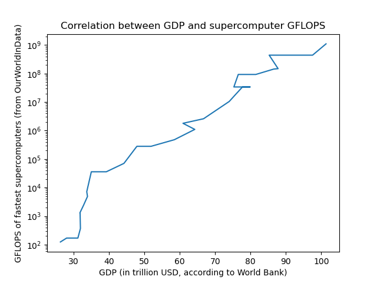

# Le danger du réductionnisme énergétique

"Nos sciences dures qui, autrefois ne parlaient que de force et d'énergie,
parlent depuis assez récemment de codes et de ce qu'on appelle en général le doux.
Les sciences dures s'occupent aussi du doux."  
2:00 https://www.youtube.com/watch?v=ZCBB0QEmT5g

Comme l'explique si bien le philosophe Michel Serres, malheureusement récemment décédé,
les sciences ont longtemps été obnubilées par la matière et l'énergie,
et le sont encore gravement.
Malheureusement, cette attention démesurée à ces grandeurs physiques peut nous rendre aveugle
à de nombreuses dimensions physiques que ces notions échouent à décrire,
à commencer par l'information, 
que Michel Serres appelle le "doux", par opposution au "dur",
en référence probablement à la distinction entre les mots anglais "software" et "hardware".

Elle a des conséquences gravissimes très concrètes.
Par exemple, les étudiants de l'école où j'ai reçu mon diplôme il y a maintenant 14 ans,
à savoir l'École Polytechnique, 
se sont mobilisés, avec succès,
lors de l'annonce d'un partenariat de leur école avec l'entreprise française Total Énergies ;
parce qu'ils ont bien conscience du désastre environnemental de l'industrie de l'énergie.  
https://www.lemonde.fr/societe/article/2022/01/29/totalenergies-renonce-a-implanter-un-centre-de-recherche-a-proximite-de-polytechnique_6111478_3224.html  
https://www.lemonde.fr/campus/article/2021/07/06/hypocrisie-total-a-polytechnique-la-revolte-des-eleves-contre-la-major-petroliere-ne-faiblit-pas_6087141_4401467.html

Cependant, ces mêmes étudiants sont généralement heureux de candidater à des entreprises privées étrangères,
après que celles-ci aient pris le soin de licencier leurs équipes d'éthique,  
https://tournesol.app/entities/yt:HbFadtOxs4k  
qu'elles aient été accusées de contribuer à des génocides par Amnesty International,  
https://tournesol.app/entities/yt:dGJzpQwA090  
ou que des autorités aient identifiées des backdoors dans leurs produits commercialisés ;  
https://www.cnet.com/tech/mobile/us-finds-huawei-has-backdoor-access-to-mobile-networks-globally-report-says/
et c'est en très grande partie parce qu'ils n'ont pas du tout conscience
de l'ampleur du désastre informationnel de ces industries.

Cette grave inattention au doux,
est particulièrement bien incarnée par les discours d'un autre diplômé de cette École Polytechnique,
le célèbre Jean-Marc Jancovici, devenu Monsieur Énergie en France.

[Extraits de Jancovici disant le mot "énergie"]

Alors, pour être clair, beaucoup de ce que dit Monsieur Jancovici est très pertinent,
notamment quand il s'agit de prendre la mesure de la catastrophe environnementale
engendrée par l'exploitation des ressources fossiles,
et l'urgence à remplacer cette exploitation par des ressources beaucoup plus décarbonnées.
En particulier, aujourd'hui, je ne compte absolument pas "clasher Monsieur Jancovici",
ou affirmer qu'il s'agit d'un charlatan.
Monsieur Jancovici a énormément apporté à la cause climatique,
en effectuant une vulgarisation d'excellente qualité sur de nombreux sujets.

Ceci dit, comme vous vous en êtes sans doute rendu compte si vous suivez le YouTube scientifique,
de plus en plus de voix s'élèvent pour contredire les fondements scientifiques 
de certains aspects de son discours,
notamment quand il s'agit de technologies et d'économie.
Et en effet, aujourd'hui je vais aussi apporter ma pierre à l'édifice,
en essayant de corriger certains raccourcis un peu dérangeants de son argumentaire.
Mais ce n'est pas tout à fait mon objectif.
 
Un aspect que je trouve plus dérangeant encore dans le discours de Monsieur Jancovici,
ce n'est pas tant la fiabilité de ses propos,
que sa tendance à trop réduire les enjeux civilisationnels à des considérations d'énergie.
J'ai trouvé cette facette de son discours particulièrement dérangeante,
lors de son intervention à l'École de Guerre,
où la manière dont il occulte le rôle de l'information me paraît très erronée et dangereuse,
surtout dans le contexte de la guerre informationnelle du 21e siècle
et du déclin globalisé des démocraties.

Plus généralement, il me semble important de déconstruire l'importance démesurée 
que beaucoup donnent à la matière et à l'énergie au 21e siècle.
En particulier, il est urgent de s'enlever les oeillères attentionnelles 
qui résultent de cette volonté à tout réduire à des problèmes d'énergie,
surtout lorsqu'il s'agit des technologies du numériques, du PIB ou des conflits armés.

En fait, comme Michel Serres, et comme vous le savez sans doute si vous me suivez,
j'estime que le plus grand défi civilisationnel du 21e siècle n'est pas énergétique.
Il est informationnel.

## Jancovici à l'École de Guerre

> Il y a assez peu d'intérêt pour la réflexion sur à quoi ressemble une stratégie de défense
> dans un monde de demain, c'est-à-dire dans un monde qui va se décarboner
> et où la dérive climatique que nous avons mis en route va continuer.  
> https://www.youtube.com/watch?v=W1b2NLTDxNs

Cette introduction du discours de Monsieur Jancovici est très factuelle.
La dérive climatique va continuer, 
avec de nombreuses conséquences sur les tensions géopolitique que cela va engendrer,
comme Monsieur Jancovici l'explique très bien plus tard dans sa conférence,
et comme le montre très bien cette excellente vidéo d'econimate.  
https://tournesol.app/entities/yt:6Mah7JcpWkw

Cependant, le prisme choisi par cette introduction révèle parfaitement 
les oeillères attentionnelles dans lesquelles ce discours s'inscrit.
En particulier, elle suggère d'ores-et-déjà que l'évolution des technologies
n'est pas ce dont il faut tenir compte, au moment d'envisager une stratégie de défense.
Et c'est bien cela qui est problématique ; 
à l'heure où des IA terrifiantes ont déjà envahi le monde.  
https://tournesol.app/entities/yt:lYXQvHhfKuM

Mais là où le discours va devenir très problématique, 
c'est au moment où Monsieur Jancovici affirme 
que l'issue de la guerre pouvait être prédite 
simplement en regardant la production de charbon avant guerre.

> Avant guerre, vous aviez déjà les cartes de la victoire de 1945 
> qui sont pour parties sur la table, en ce sens que, 
> dans cette confrontation de force brute qu'est un conflit,
> eh bien vous voyez les protagonistes du conflit, de quels muscles ils disposent,
> au moment où ils vont jeter les forces dans la bataille.
> Et c'est encore plus fragrant que vous regardez ce qui permet d'actionner les engins de combat.
> En 1940, les États-Unis produisaient quasiment les 2/3 du pétrole mondial. [...]
> Donc là, vous avez également en filigrane les clés, j'ai envie de dire, de la victoire de 1945.  
> https://www.youtube.com/watch?v=W1b2NLTDxNs 9:06

Oubliez la quête de la bombe nucléaire, 
l'organisation logistique des bases arrières et du front,
le déchiffrement des communications Nazies
les opérations Fortitude de désinformation et de diversion des Alliés,
ou la propagande de guerre pour rallier les forces humaines.
À en croire Monsieur Jancovici, 
toutes ces opérations sur le "doux" auraient eu peu d'importance dans le passé.
Pour gagner une guerre, ce qui comptait avant tout, c'était la dépense énergétique.

Et au moment de se projeter dans l'avenir,
Monsieur Jancovici ne nuance pas son propos.
Il enchaîne rapidement avec ce qui est, selon lui, le grand défi des armées au 21e siècle :

> Alors, ça c'est le passé.
> Mais maintenant, le premier défi qui va se poser dans le futur aux forces armées,
> c'est qu'est-ce qu'on va faire avec de moins en moins de pétrole.
> Parce que c'est bien ça la première question qui se pose.  
> https://www.youtube.com/watch?v=W1b2NLTDxNs 11:42

Et c'est vraiment à ce moment là que j'ai envie de hurler :
"ce monsieur est en train de donner de très mauvais conseils à l'Armée Française".

Est-ce que la Russie, qui produit et consomme 15 fois plus de pétrole que l'Ukraine,
avec une population "seulement" 4 fois supérieure,
à écraser l'Ukraine, comme ce raisonnement purement énergétique semble le prédire ?  
https://en.wikipedia.org/wiki/List_of_countries_by_oil_production  
https://en.wikipedia.org/wiki/List_of_countries_by_oil_consumption

## La dimension informationnelle de la seconde guerre mondiale

Alors, je ne suis pas historien 
et je ne vais absolument pas prétendre que l'information a joué un rôle prédominant dans la guerre.
Cependant, j'aimerais bien faire le point sur la dimension informationnelle
de la seconde guerre mondiale,
et essayer de vous convaincre qu'il serait précipiter de complètement l'occulter.

Pour commencer, si vous avez vu le film Oppenheimer,
vous savez que la seconde guerre mondiale a vu la naissance d'une arme de destruction massive,
à savoir l'arme nucléaire.
Et si les États-Unis ont réussi à se doter de cette arme terrifiante,
ce n'est absolument pas en brûlant davantage de pétrole et de charbon ;
ils ont avant tout profité de l'exode des cerveaux européens, 
pour former une dream team de scientifiques.
Et alors, certes, l'arme nucléaire n'aura pas beaucoup joué sur l'issue de la guerre,
en tout cas sur son développement sur le continent européen.
Mais il faut bien voir que c'est avant tout parce qu'elle a été découverte trop tard,
et qu'elle l'a été par les vainqueurs de la guerre.
Imaginez si le physicien Werner Heisenberg et ses collègues au service des forces Nazies
avaient réussi cette avancée informationnelle avant 1945 !
Je pense qu'on peut largement dire que 
cet échec informationnel des Nazis a joué un rôle majeur dans l'issue de la guerre.
Et de façon plus général, les technologies des armes de guerre sont clairement des enjeux majeurs
pour déterminer les issues d'une guerre.  
https://www.reuters.com/business/aerospace-defense/exclusive-us-assesses-up-60-failure-rate-some-russian-missiles-officials-say-2022-03-24/

Mais c'est loin d'être le seul défi informationnel qui se pose à des armées immenses,
déployées dans un contexte complexe et dynamique.
En particulier, un autre grand défi est logistique.
Comment s'assurer que les matériels indispensables fournis par les bases arrières
soient livrées de manière efficace sur le front ?
Eh bien, c'est pendant cette seconde guerre mondiale 
que les mathématiques de la logistique ont été inventées,
notamment par l'américain Dantzig et le soviétique Leonid Kantorovich,
lequel gagnera le prix Nobel d'économie en 1975 pour ses travaux.
On les appelle aujourd'hui "recherche opérationnelle", 
qui s'appuie notamment abondamment sur la programmation linéaire.
Et plus généralement, il faudrait toute une vidéo pour les inventions du seul John von Neumann,
aux États-Unis, pendant uniquement la seconde guerre mondiale,
de la conception des ordinateurs à la théorie des jeux,
en passant par l'optimisation, les méthodes de Monte Carlo ou le tri-fusion.
Là encore, il semble que les contributions des scientifiques des Alliés au traitement de l'information
ont été supérieures à celles des forces Nazies, et cela a sans doute aidé.
Au moins un peu.

Mais en matière de traitement de l'information pendant la seconde guerre mondiale,
difficile de faire mieux que le génie anglais Alan Turing.
Comme le met en scène le film "Imitation Game",
qui est quand même à prendre avec de grosses pincettes sur son authenticité à la fois historique et mathématique,
l'unité spéciale et secrète de Bletchley Park était un camp britannique de hackers,
dont Turing faisait partie,
et qui a réussi à hacker un grand nombre de messages secrets échangés 
par les forces Nazies de manière chiffrée.
Voilà qui a notamment permis aux forces alliées de déterminer les localisations de sous-marins Nazis,
et de permettre l'acheminement sécurisée des ressources des États-Unis vers l'Europe.
Le philosophe Jack Copeland estime que cette cyberattaque informationnelle
a peut-être permis de raccourcir la guerre de deux ou trois ans, 
et ainsi de sauver 14 à 21 millions d'individus.  
https://www.bbc.com/news/technology-18419691

Mais l'espionnage des secrets des forces ennemies 
est loin d'être la seule facette de la guerre dans l'espace informationnel.
En particulier, pour maximiser les chances de succès du débarquement de Normandie
dans la nuit du 5 au 6 juin 1944,
événement majeur dans cette guerre qui permet l'ouverture d'un nouveau front à l'ouest,
les Alliés ont mis en place une Opération appelée Fortitude,
qui vise à faire croire aux ennemis qu'un débarquement aurait lieu ailleurs,
ou que le débarquement en Normandie ne serait qu'une diversion,
et pas la véritable offensive.
En particulier, il s'agissait de faire croire aux Nazis 
qu'une offensive majeure était planifiée en Norvège ou dans le Pas-de-Calais.
Et pour y arriver, Fortitude créa des unités fantômes, 
avec des communications radios intenses et factices,
ainsi que des fuites contrôlées de fausses informations via des canaux diplomatiques neutres,
notamment à travers les États neutres.
De plus, des agents doubles, au service des Alliés, 
mais que les Nazis croyaient être des infiltrés dans les forces Alliées à leur service,
ont été utilisé pour diffuser des informations trompeuses.
Enfin, l'efficacité de cette manipulation informationnelle a pu être confirmée par les Alliés,
grâce aux travaux de Turing qui permettait aux Alliés de s'assurer des croyances secrètes des Nazis.
Et toutes les sources que j'ai trouvées décrivent en particulier Opération Fortitude
comme un succès important dans l'avancée des forces Alliées.  
https://en.wikipedia.org/wiki/Operation_Fortitude#Impact

Enfin, comment ne pas mentionner la propagande 
dans l'analyse du rôle de l'information dans la seconde guerre mondiale ?
En particulier, même avant cette guerre, 
une nouvelle technologie de l'information semble avoir un joué un rôle non-négligeable
dans la voie vers la guerre.
Côté Nazi en particulier, le ministre Joseph Goebbels a beaucoup oeuvré
pour rendre la radio assez abordable pour que toute la population allemande puisse l'écouter.
Autrement dit, il a mis dans les demeures et les cafés de sa population
un outil capable de diffuser massivement les propos de son Führer,
et ainsi de mobiliser son peuple et le motiver à prendre les armes.
Et puis, comment ne pas mentionner le rare mot de gloire de la France pendant cette guerre,
à savoir l'appel du 18 juin 1940 du Général de Gaulle,
qui grâce aux nouvelles technologies de l'information
a pu envoyer un message à tous les Français mécontents de l'occupation Nazie ?  
https://daily.jstor.org/an-affordable-radio-brought-nazi-propaganda-home/

Bref. Clairement, s'ils avaient un ascendant énergétique,
les Alliés avaient aussi un énorme ascendant informationnel.
Et cet ascendant informationnel me semble avoir joué un rôle non-négligeable 
dans la seconde guerre mondiale.
Mais surtout, ce rôle me semble être devenu plus central que jamais dans la guerre moderne.

## La guerre moderne est avant tout informationnelle

Pour bien se rendre compte à quel point il est devenu crucial 
de ne pas ignorer la dimension informationnelle de la guerre moderne,
il n'y a sans doute pas mieux que d'écouter 
comment un général 4 étoiles de l'Armée Américaine envisage le futur de la guerre,
interviewé sur la chaîne Smarter Every Day.

> Cependant, les choses ont changé, comme vous le savez mieux que n'importe qui.
> Le monde est devenu tellement complexe.
> Et maintenant il y a d'autres domaines.
> Le cyber espace.  
> https://www.youtube.com/watch?v=qOTYgcdNrXE 12:46

Notez le contraste saisissant avec le discours de Monsieur Jancovici.

> Alors, ça c'est le passé.
> Mais maintenant, le premier défi qui va se poser dans le futur aux forces armées,
> c'est qu'est-ce qu'on va faire avec de moins en moins de pétrole.
> Parce que c'est bien ça la première question qui se pose.  
> https://tournesol.app/entities/yt:qOTYgcdNrXE 11:42

Revenons au discours du Général Américain.

> Ce qu'on voit aujourd'hui, c'est qu'on peut influencer quelqu'un 
> même avant d'être conflit avec eux.
> Vous pouvez l'influencer dans le cyber domaine ;
> Vous pouvez l'influence dans le domaine spatial.
> Et vous pouvez influencer et il n'y a pas de frontières dans ces domaines [...]
> Destin: "J'ai suivi les actualités, et je sais qu'il y a d'énormes campagnes
> sur les réseaux sociaux qui ont lieu avant qu'une bataille ait vraiment lieu.
> Est-ce vrai ?".
> Oui, on parle de zone grise.
> Vous pouvez regarder ce que certaines nations font.
> La Russie est très forte à cela, la Chine aussi,
> dans ce qu'on appelait avant la phase zéro, la phase pré-conflit.
> Je n'aime pas du tout ce terme. 
> Il y a toujours de la compétition, et on est dans une hypercompétition maintenant. Toujours.  
> https://www.youtube.com/watch?v=qOTYgcdNrXE 13:34

C'est d'ailleurs pour cela qu'il peut être inapproprié de parler de guerre informationnelle.
Après tout, la guerre est en principe régi par le droit de la guerre,
qui interdit notamment les crimes de guerre, comme le meurtre intentionnel de civils.
Par ailleurs, la guerre doit en principe être précédée d'une déclaration de guerre,
et s'achève par un traité de paix, ou un accord de reddition.

Cependant, les conflits dans le cyberespace sont en fait permanents,
abusent abondamment des civils, et ne nécessitent pas de déclaration.
Mais l'ampleur de ces conflits est tel qu'il me semble réducteur de les appeler "conflits".
On assiste régulièrement à des déstabilisations de pouvoirs,
et à des changements de rapports de force dans les superpuissances.
Ces "conflits informationnels" dessinent aujourd'hui les contours de la géopolitique mondiale.
De manière informelle, je préfère donc parler de "guerre informationnelle",
même si ce n'est pas une expression idéale.

> Et vous avez tout à fait raison.
> Ils vont travailler pour fabriquer et influencer la perception des populations
> avant même qu'un conflit ait lieu,
> en espérant que ce soit un fait accompli, et qu'avant qu'une balle était tiré
> ils aient déjà vaincu.  
> https://www.youtube.com/watch?v=qOTYgcdNrXE 13:34

Comme l'explique si bien le Général,
une énorme partie de la guerre moderne est purement informationnelle.
Il suffit ainsi de diffuser des informations trompeuses, polarisantes et haineuses,
dans une nation ennemie pour complètement la déstabiliser,
et pour l'affaiblir sur les plans économiques, institutionnelles et militaires ;
sachant que tout ceci est intrinsèquement lié.

De la même manière, 
il y a un enjeu existentiel pour certaines armées à mobiliser son peuple,
ne serait-ce que pour recruter des militaires,
à l'instar de ce qu'on voit aujourd'hui en Russie, en Ukraine ou à Taïwan.
Mieux encore, en contrôlant la diffusion information chez des alliés et des ennemis,
les différentes puissances militaires peuvent obtenir ou perdre des soutiens.
Là encore, la guerre de l'information devient existentiel, 
comme on l'a vu dans le cas des conflits au Yémen, en Éthiopie ou au Soudan.

Dès lors, si on regarde la guerre avec des lentilles informationnelles,
on devrait avant tout être terrifié par des armes de destruction informationnelles comme TikTok.  
https://tournesol.app/entities/yt:iW0LiIMYqrU

Dans ce cyber espace, les opérations informationnelles sont des armes.
En tout cas selon le Général.

> Les opérations sont multi-domaines : terre, mer, espace, air, et cyber.
> Est-ce que cette vidéo est une arme ?
> Absolument.
> Donc je viens de fabriquer une arme ?
> Oui, si ça peut aider des gens à comprendre, premièrement,
> Si ça peut dissuader ceux qui nous veulent du mal,
> c'est une arme de malade.
> Et si ça aide ceux qui travaillent à mieux comprendre, à mieux nous soutenir,
> alors c'est une sacré arme.
> https://tournesol.app/entities/yt:qOTYgcdNrXE 21:22

Après tout, certaines armes, comme l'arme nucléaire, ont pour but premier la dissuasion.
Si à travers des informations, 
une armée peut décourager l'ennemi de se lancer dans une course à l'armement,
alors elle peut renforcer la sécurité nationale de son pays, 
sans même sortir les armes physique.

Enfin, et peut-être surtout, en tout cas selon le Général,
il s'agit d'armer les militaires, voire la population, 
pour éviter ou savoir réagir à un conflit.
En fait, de nos jours, l'armement le plus important, c'est sans doute l'armement informationnel.

> Vous ne pouvez pas faire tout ça si vous ne rendez pas les gens plus puissants.
> Destin: "Que voulez-vous dire ?"
> Si vous avez quelqu'un à qui vous donner une tâche,
> et c'est tout ce dont ils sont capables,
> alors cela ne marchera jamais.
> Vous devez avoir la faculté de rendre vos hommes plus doués.
> C'est ce que nous appelons dans l'Armée le commandement des missions,
> et les autres services ont des versions similaires.
> Où je peux donner à quelqu'un un objectif que je veux,
> et ils découvrent d'eux mêmes comment y arriver.
> Et ils vont vous impressionner par leurs facultés.
> Les jeunes leaders talentueux, notre peuple, c'est notre avantage.
> Les meilleurs officiers non-commisionnés du monde,
> Les meilleurs leaders à qui ont a appris à s'en sortir brillamment
> dans des situations d'ambiguité et de chaos.  
> https://tournesol.app/entities/yt:qOTYgcdNrXE 19:32

## L'énergie est-elle vraiment le moteur de la croissance ?

Alors, dans cette vidéo, 
je me suis surtout concentré sur le rôle de l'information,
par opposition au rôle de l'énergie,
pour les forces armées.
Notamment parce que dans le contexte actuel, 
occulter la guerre de l'information me semble extrêmement dangereux.

Cependant, l'oeillère énergétique,
qui nous invite à réduire tant de phénomènes complexes à la consommation d'énergie,
est aussi problématique dans de nombreux autres domaines,
à commencer par l'économie.

> Le PIB mondial, vous voyez qu'il suit depuis quelques décennies au moins
> l'énergie utilisé, c'est-à-dire en fait le parc de machines en service.
> Eh bien l'économie mondiale est directement fonction de la quantité de machines 
> qu'on peut faire fonctionner.  
> https://www.youtube.com/watch?v=W1b2NLTDxNs 25:57

Cette affirmation, on la retrouve dans les discours d'un très grand nombre d'écologistes.
Et à bien y réfléchir, elle paraît extrêmement présomptueuse.
Augmenter l'ampleur des transactions informationnelles 
entre les comptes bancaires digitaux de l'économie réelle, 
ce qui est, de manière grossière, ce que mesure le PIB,
est-ce vraiment directement conséquent de la quantité de pétrole qu'on brûle ?

Le principal argument pour obtenir cette conclusion est malheureusement très faible :
une simple corrélation entre le PIB mondial et un nombre de machines en service.
À ce jeu-là, je peux à mon tour "montrer" que l'économie est en fait fonction
de la quantité d'opérations informationnelles dans le monde.
Voilà à l'écran le même graphe,
mais qui évalue cette fois la corrélation entre PIB 
et la capacité de calcul des plus puissants supercalculateurs.
Eh paf ! Il suffit de faire des machines qui calculent plus vite, 
pour augmenter le PIB.

Alors techniquement, j'ai pris le logarithme de la puissance de calculs des supercalculateurs,
parce que celle-ci est vraiment exponentielle, 
contrairement au PIB qui est plus linéaire,
mais je peux maintenant me féliciter d'avoir un r² égal à 0,95.
Pas loin de celui calculé par Monsieur Jancovici !

Alors bien sûr, ma "preuve" est en fait ridicule.
D'abord, parce que la corrélation mesure mal à quel point une variable prédit l'autre ;
non seulement corrélation n'est pas causalité,
mais il est aussi tout à fait possible d'avoir X qui explique entièrement Y,
et avoir une corrélation nulle entre X et Y, comme j'en ai parlé dans une vieille vidéo.
Bref, le fait que la corrélation soit très proche de 1 n'est pas davantage convaincant.  
https://tournesol.app/entities/yt:Ee8gLwVCPxg

Mais surtout, en pratique, on observe surtout une croissance du PIB au cours du temps.
Et donc à peu près n'importe quelle courbe 
qui monte ou descend avec le temps sera très corrélée avec le PIB.
Et pour le coup, c'est très facile de trouver des courbes qui montent avec le temps.
La chercheuse en science des données Hannah Ritchie,
éditrice du site Our World in Data, en met une ribambelle dans sa présentation TED.  
https://tournesol.app/entities/yt:Kl3VVrggKz4

Ainsi, j'ai utilisé le logarithme de la puissance de calcul des supercalculateurs,
mais j'aurais très bien pu utiliser le nombre de transistors,
la capacité de stockage des centres de données ou le débit des câbles pour accéder à intermet.

Cependant, on peut aller plus loin que simplement questionner l'argument de Monsieur Jancovici,
et s'attaquer plus directement sa conclusion, 
lancée avec extrêmement peu de modestie épistémique :

> l'économie mondiale est directement fonction de la quantité de machines 
> qu'on peut faire fonctionner.  
> https://www.youtube.com/watch?v=W1b2NLTDxNs 25:57

Pourtant, on trouve sur l'excellent site OurWorldInData un article 
qui suggère non seulement que plusieurs pays ont au moins conservé une croissance économique 
tout en réduisant leurs émissions de CO2,
mais même que certains pays ont presque réussi à y parvenir
sans augmenter leurs consommations énergétiques,
y compris lorsqu'on tient compte de la délocalisation des lieux de production,
comme l'Allemagne, la Suède, la Suisse et la France.  
https://ourworldindata.org/co2-gdp-decoupling

Bien entendu, il n'est pas encore clair que ce découplage soit vraiment robuste ;
et même si c'est le cas, il est encore extrêmement insuffisant 
pour éviter la catastrophe environnementale.
Par ailleurs, on peut se demander si le PIB est vraiment ce qu'il nous faut maintenir élevé, 
pour protéger la santé, la sécurité et le bien-être des populations.
Cependant, sachant ces graphes, affirmer sans broncher que

> l'économie mondiale est directement fonction de la quantité de machines 
> qu'on peut faire fonctionner.  
> https://www.youtube.com/watch?v=W1b2NLTDxNs 25:57

Ça me semble être beaucoup trop péremptoire.
Et ce sont ces aspects qui semblent déranger de plus en plus mes collègues sur YouTube,
notamment Gilles de la chaîne Heu?reka.

> En gros, quand je parle de crise de l'offre, 
> donc toute la partie qui parle d'environnement, là ça a quand même pas mal changé.
> Qu'est-ce qu'on peut faire ? Qu'est-ce qui nous pend au nez ?
> Ce à quoi on peut s'attendre.
> Là clairement, l'interprétation jancoviciste de la première édition a bah disparu...
> Oula, gros dossier, on se fâche avec Janco ?
> Non, disons que j'ai fait quelque chose de plus GIEC et AIE compatible.
> Donc, plus extrapolation à partir des données scientifiques disponibles,
> Et moins des interprétations un peu biaisées à la Janco.
> Qu'est-ce qui va pas avec l'interprétation à la sauce Janco ?
> Plein de trucs.
> Oh ! Tu oses ?  
> https://www.youtube.com/watch?v=MpXxSq5cRMo 1:31

Et l'impact économique de l'énergie n'est pas le seul point 
sur lequel le discours de Monsieur Jancovici mérite d'être repris.

> Vous n'avez qu'un seul moyen de puissance décarbonée, c'est le nucléaire.
> Donc pour faire avancer un gros bâtiment, hors combustible fossile,
> il n'y a qu'un seul truc qui fonctionne : c'est un réacteur.  
> https://www.youtube.com/watch?v=W1b2NLTDxNs 35:55

Là encore, ça me paraît hautement péremptoire, 
sachant que des porte-conteneurs électriques existent déjà aujourd'hui.  
https://en.wikipedia.org/wiki/MV_Yara_Birkeland

Et plus globalement, 
on semble ici avoir un archétype de sous-estimation 
du progrès technologique en énergie renouvelable,
que Rodolphe, alias Le Réveilleur, a déjà pris le temps de déconstruire.

> Je suis manifestement en désaccord avec Monsieur Jancovici [...]
> Dans cette vidéo, j'attaque entre autres le message que le lecteur comprend
> à la lecture de la BD "Le Monde Sans Fin" [...]
> L'idée que le passage aux énergies renouvelables sonne la fin de notre société d'abondance
> n'est donc pas, ou extrêmement mal, étayée dans la BD.
> Pour moi, le titre de cette vidéo est justifié.
> Les arguments avancés par Jean-Marc Jancovici dans l'échange de mails ne m'ont pas convaincu.
> et l'absence de sources et de quantifications m'empêchent de voir autre chose
> qu'une opinion peu justifiée, quand je lis que le passage aux énergies renouvelables
> sonne la fin de nos sociétés complexes.
> https://tournesol.app/entities/yt:HgfcZeGP7BA 1:21:52

Ceci étant dit, comme Rodolphe, 
j'insiste à nouveau sur le fait que tout n'est pas à rejeter 
dans le discours de Monsieur Jancovici ;
et il ne s'agit en aucun cas de dénigrer tout son travail, 
ou de le harceler sur les réseaux sociaux.
D'autant que son discours sur l'ampleur du danger de la dépendance
à des systèmes d'informations mal sécurisés est en fait excellent.

> Alors par contre la digitalisation crée une vulnérabilité en tant que tel,
> parce que vous avez aujourd'hui un certain nombre de processus vitaux à court terme
> qui dépendent du numérique.
> Le premier d'entre eux, c'est le fonctionnement du système monétaire.
> Aujourd'hui le système monétaire mondial, c'est des ordinateurs.
> Ce n'est que ça.
> Donc si on n'a plus d'ordinateur, on n'a plus de système monétaire mondial.  
> https://tournesol.app/entities/yt:qOTYgcdNrXE 1:24:11

Je trouve dommage que ces propos très perspicaces de Monsieur Jancovici 
n'interviennent que suite à une question de l'auditoire,
telle une note de bas de page dans les grandes lignes du programme de Défense du 21e siècle.

Mais j'y souscris entièrement ; et j'aimerais qu'on aille même plus loin.
Sécuriser les systèmes d'information me semble être devenu un enjeu majeur de la sécurité nationale.
Et donc, il me semble qu'il devrait s'agir d'une priorité de l'Armée française.
En fait, la guerre mondiale de l'information a déjà largement commencé.
Et si on n'y prête pas attention, 
on risque de voir nos démocraties s'effondrer bien avant de subir les désastres environnementaux.

